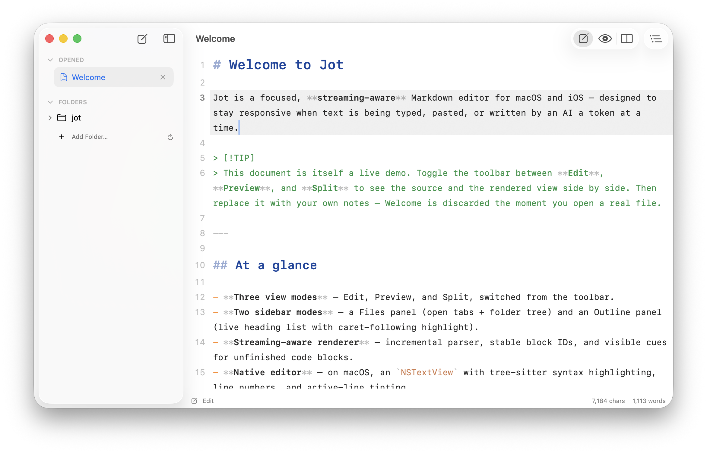
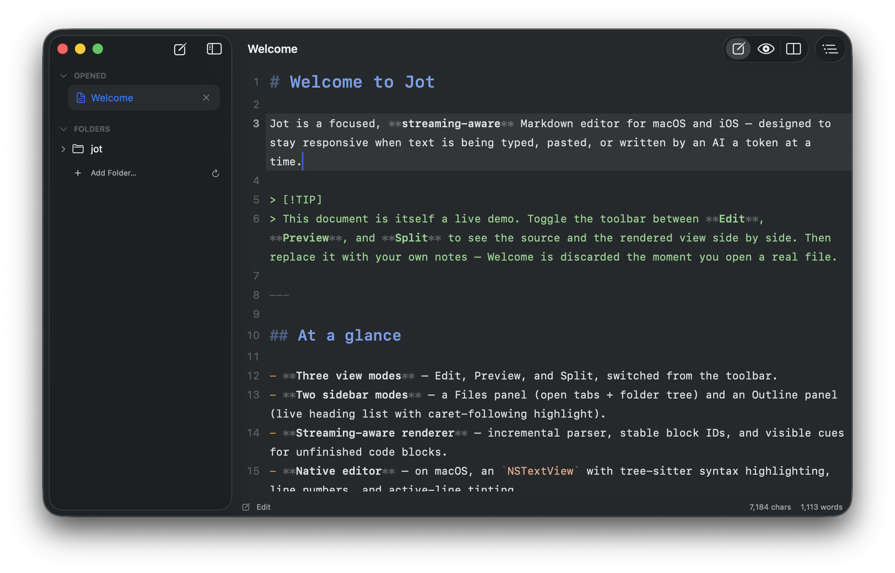
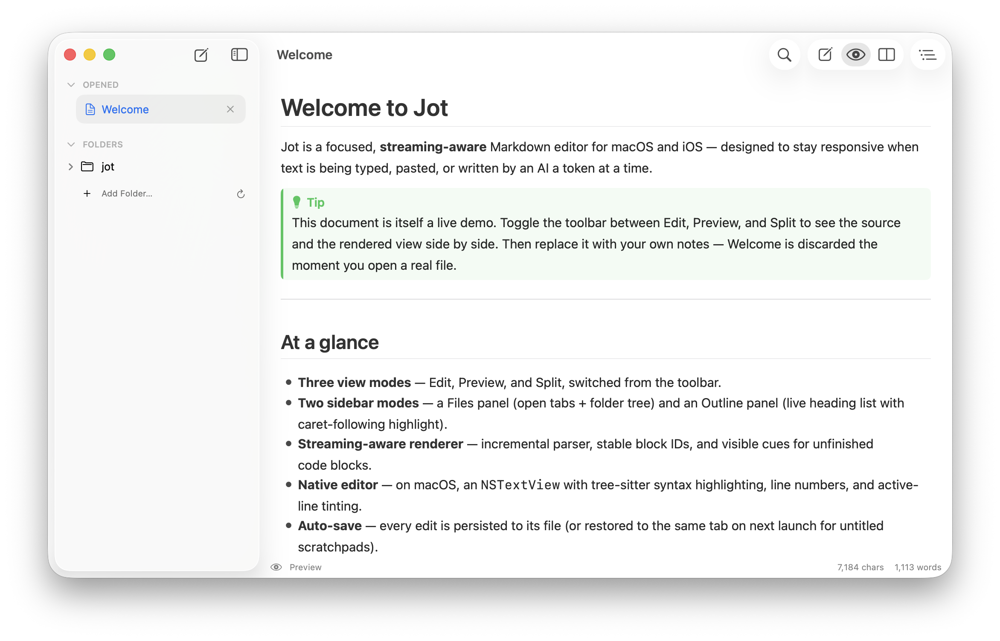
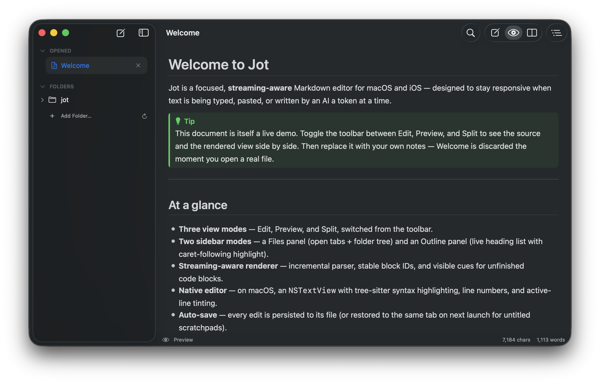

# macOS

🇺🇸 [English](README.md) · [🇨🇳 简体中文](README_zh-Hans.md) · **🇹🇼 繁體中文** · [🇯🇵 日本語](README_ja.md) · [🇰🇷 한국어](README_ko.md) · [🇪🇸 Español](README_es.md) · [🇩🇪 Deutsch](README_de.md) · [🇫🇷 Français](README_fr.md) · [🇮🇹 Italiano](README_it.md) · [🇧🇷 Português](README_pt-BR.md) · [🇷🇺 Русский](README_ru.md)

  
  

  
  

Jot 是一款專注於串流寫入的跨平台 Markdown 編輯器，支援 macOS 和 iOS — 即使在 AI 逐 token 寫入文字時也能保持流暢回應。

## 功能特性

- **即時 Markdown 預覽** — 支援編輯、預覽、分屏三種視圖模式
- **串流寫入優化** — AI 逐 token 寫入時依然保持流暢回應
- **語法高亮** — 基於 Tree-sitter 的 Markdown 和程式碼區塊高亮
- **原生檔案處理** — 使用 DocumentGroup + FileDocument 實現標準 macOS 檔案操作
- **側邊欄** — 檔案樹和大綱面板
- **偏好設定** — 字體大小、字體族、行高，以及設定的匯入/匯出

## 系統需求

- macOS 14.0+
- Xcode 15+
